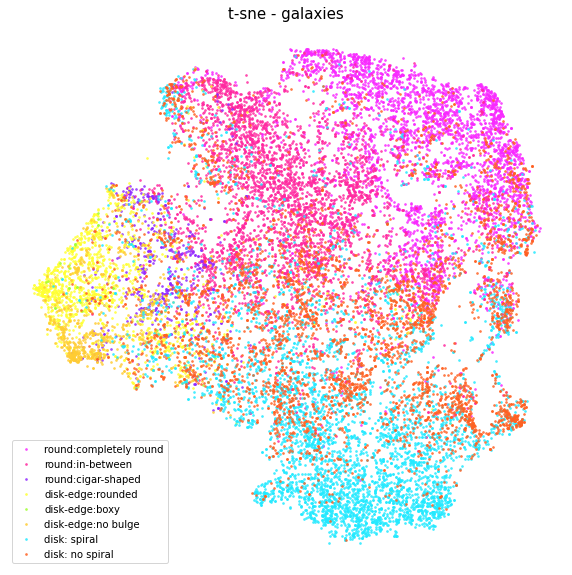
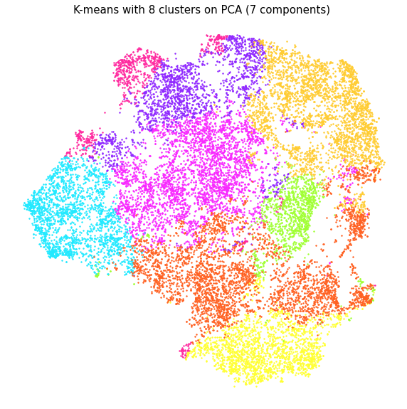

# galactic-clustering

**Code:**  
1. [CNN training](https://github.com/mkcyoung/galactic-clustering/blob/main/Gal_Net.ipynb)
2. [Dimensionality reduction and clustering](https://github.com/mkcyoung/galactic-clustering/blob/main/dim_reduction_exploration.ipynb)
3. [UMAP exploration](https://github.com/mkcyoung/galactic-clustering/blob/main/umap_dim.ipynb)
  
**Reports:**
1. [Final Report](https://github.com/mkcyoung/galactic-clustering/blob/main/Data%20Mining%20Final%20Report.pdf)
2. [Poster](https://github.com/mkcyoung/galactic-clustering/blob/main/galaxy_poster_v2.pdf)

## An exploration (through dimensionality reduction and clustering) of the features learned in a CNN trained on crowd-source-labeled galaxy images.

There’s a veritable deluge (think: petabytes) of astronomical data being generated from surveys like the Sloan Digital Sky Survey (SDSS). In fact, there is far more data out there than could be analyzed by expert astronomers within a reasonable time frame. In order to meet this daunting data challenge, researchers are pursuing many different strategies such as crowd-sourcing classification tasks, data mining and machine learning techniques aimed at classifying and discovering insights from survey data. This project is focused on the intersection of these methods: **we seek to explore (through dimensionality reduction and clustering) the features learned in a convolutional neural network (CNN) trained on crowd-source-labeled galaxy images.**

## Training a CNN
The dataset we used came from a [Galaxy Zoo kaggle competition](https://www.kaggle.com/c/galaxy-zoo-the-galaxy-challenge/data) launched in 2013. The dataset includes more than 130,000 images of galaxies. 61,578 of these images were labeled by the Galaxy Zoo participants. The ‘labels’ were the percentages of responses to 37 questions asked of each volunteer during the galaxy classification. In order to develop a succinct way for us to ‘label’ galaxies, we followed the questionnaire decision tree and labeled galaxies based on their highest percentage responses. This created a total of 8 different galaxy labels.

A random subset of 30,000 of these labeled images were used to train and validate our CNN. We found that training with ResNet34 (pretrained on ImageNet), yielded the best results. After our CNN was trained, we fed in a random subset of 20,000 images and extracted the last fully connected layer to produce a “CNN code” or feature vector corresponding to each image. It was on this set of 20,000, 512-element feature vectors that we performed our dimensionality reduction and clustering.

## Dimensionality reduction & clustering
We explored 3 dimensionality reduction techniques: t-SNE, PCA, and LDA. Of these, t-SNE made for the best visualization in 2 dimensions.
t-SNE did a fairly good job at
separating out the features into their
distinct categories. The ‘round’ galaxies
(pinks and purples) are all near each other
toward the top. The disk-edge galaxies
(yellow, green and light orange) seem to
gather around the left of the plot. The spiral
disk galaxies gather largely near the
bottom, while the non-spiral disks are
distributed near the bottom but also near the
top, suggesting that the network may have had a difficult time learning the features of these.

  
When clustering with PCA using 7 componenets (and displaying cluster membership on a t-SNE plot), we see qualitatitively that the result is fairly close to the "ground truth" t-SNE plot above.   
  

  
For more results, see the [full report](https://github.com/mkcyoung/galactic-clustering/blob/main/Data%20Mining%20Final%20Report.pdf) or [poster](https://github.com/mkcyoung/galactic-clustering/blob/main/galaxy_poster_v2.pdf).

## Acknowledgements
This was the final project for the course CS 6140: Data Mining, taught by [Jeff Phillips](https://www.cs.utah.edu/~jeffp/) at the Universtiy of Utah. The poster for the project ranked in the top three for "best poster" in the poster session at the end of the semester. My partner for this project was Fangfei Lan. Her contributions centered around performing the cluster comparisons. 
